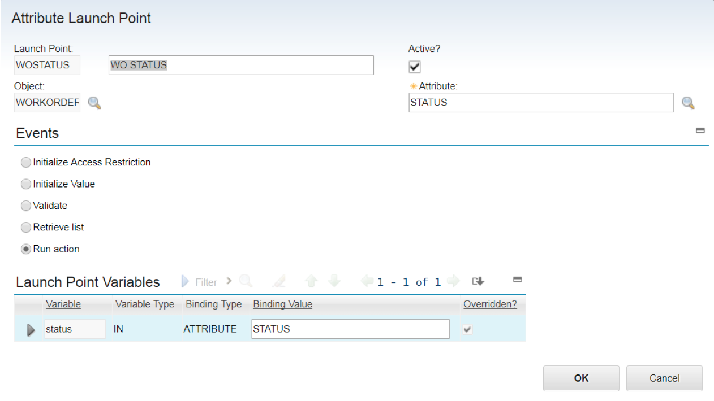
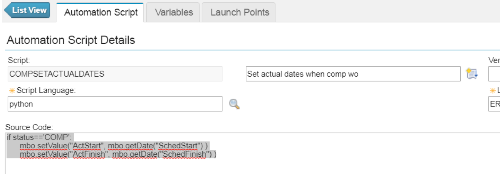
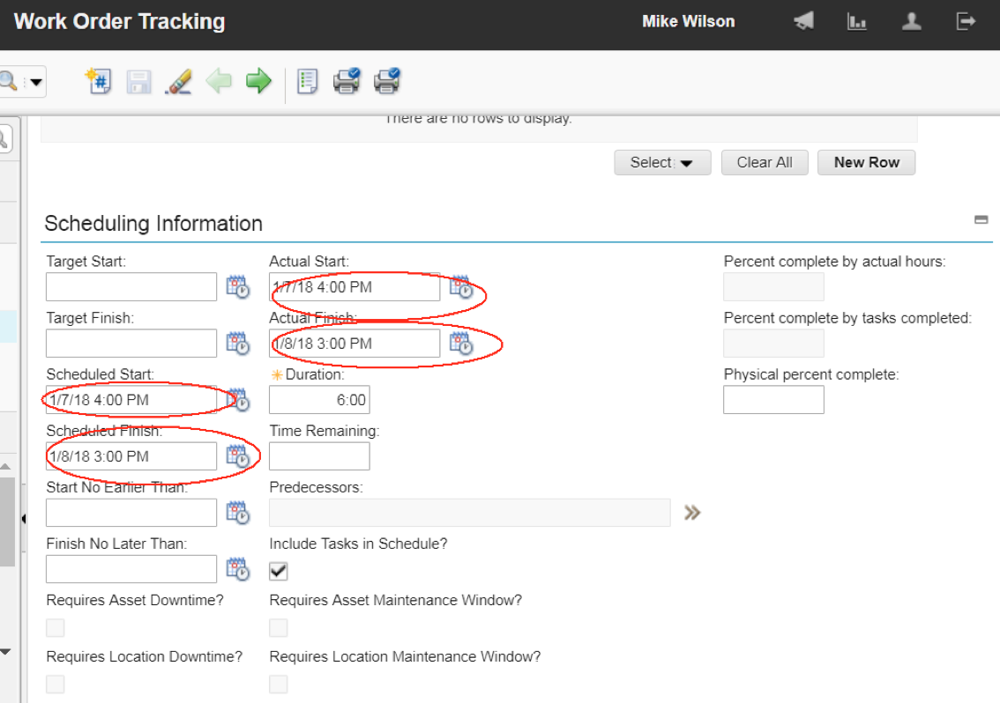

# Automamtion script to set actual dates from scheduled dates when a work order is completed 

## Setup:
 
1. In Maximo Asset Management, open the Automation Scripts application and create a script by selecting the **Create Script** action.. 
2. From the menu, select the **Create > Script with Attribute Launch Point** action and specify the following information: 
..* **Object** field: WORKORDER
..* **Atribute** field: STATUS 
..* **Variable** field: status

<!-- [Automation Scripting image 1](samples/sample01/SP01.png)-->

</center>

Click **Next**.

3. In the script name field, enter <code>COMPSETACTUALDATES</code>. This name is used in the documentation for the [Import/Export an Automation Script](samples/AS11_importExportScripts.md) sample. 
<center>

4. In the **Source Code** field, enter the following code and, if necessary, edit the term "COMP" to match the term that you use for the completed status:

```python
...
    if status=='COMP':
       mbo.setValue("ActStart", mbo.getDate("SchedStart") )
       mbo.setValue("ActFinish", mbo.getDate("SchedFinish") )
...       
```
<!-- [Automation Scripting image 2](samples/sample01/SP02.png) -->
<center>

</center>

To verify that the automation script works, in the Work Order Tracking application, change the status to complete. The actual dates should be set to scheduled dates:

<!--  -->
<center>

</center>
