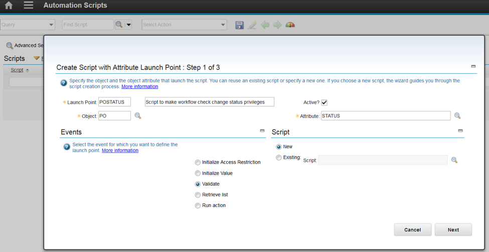
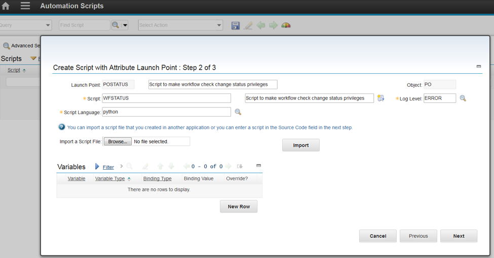
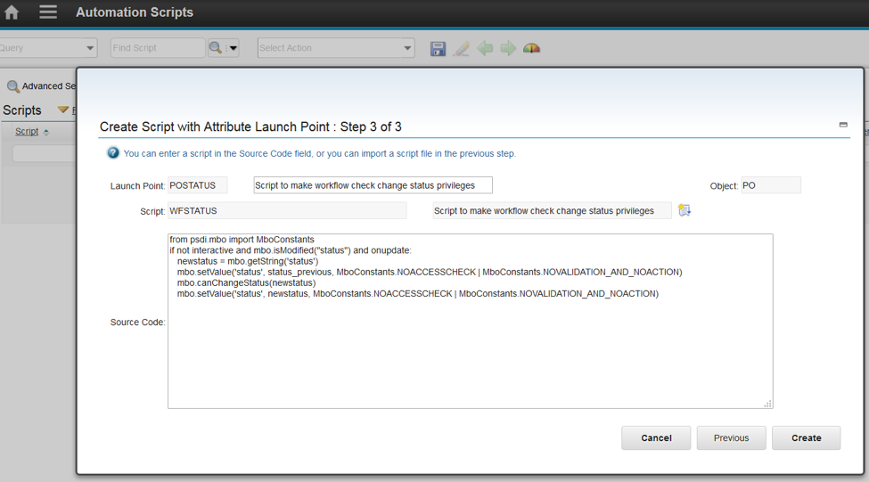
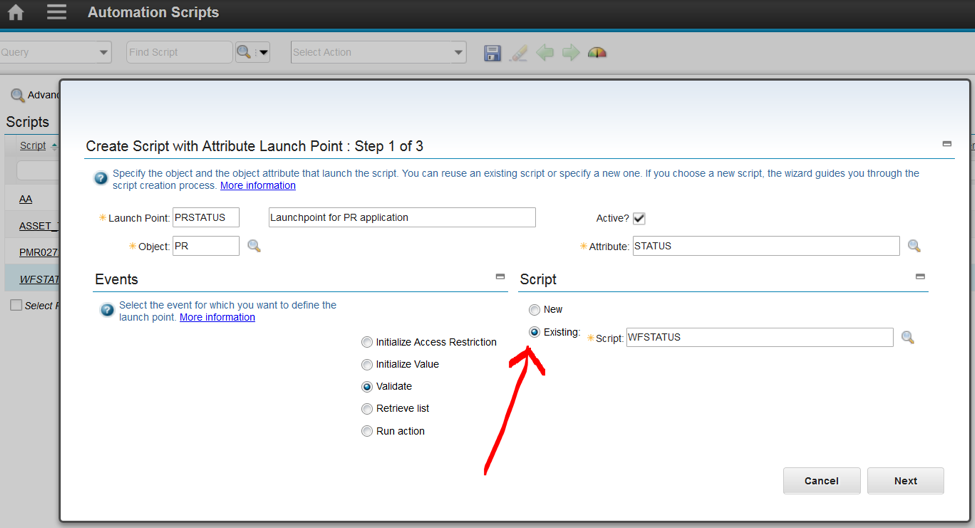
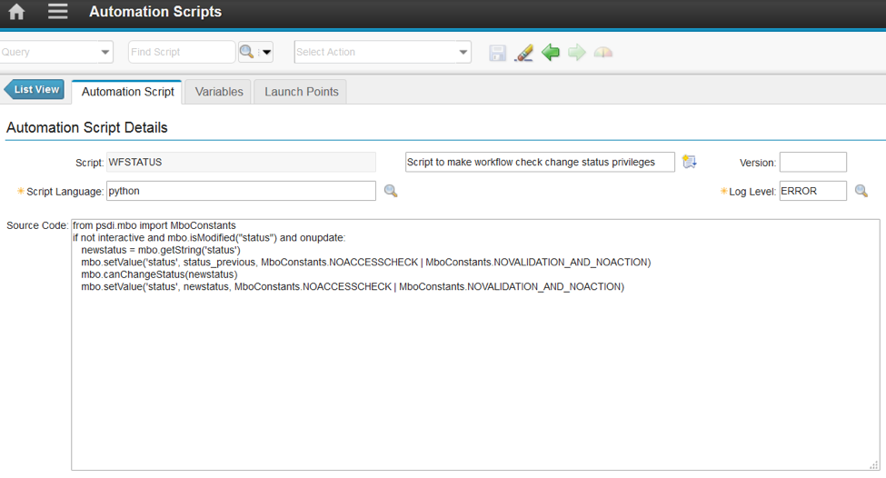
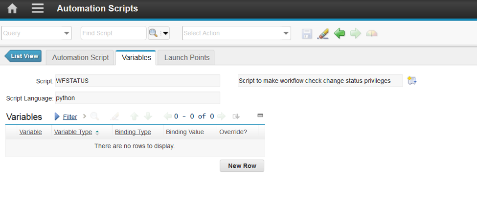

# Automation Script to make workflows follow the status privileges that are defined by security groups

The default behavior of a workflow is to ignore security group privileges for status changes and other options.  If a user who does not have the approval privilege for work orders set in the Security Groups application gets a work order that needs routed to them in a workflow, the workflow will ignore the fact that the user does not have the approval privilege and allow the user to approve the work order. Maximo Asset Management operates this way because the designer of the workflow process specifically sent the work order to this user for approval, so the approval is allowed. This behavior also allows Maximo administrators the flexibility to remove the change status privileges from the users so that they cannot change the status in the Work Order Tracking application but still can change the status by using a workflow.

This automation script changes that default behavior. When this script is in place and active, a workflow will only allow the user to change the status if they have that status privilege granted to them in the Security Groups application. This script only changes the default behavior for status changes. The workflow will still ignore other Security Group provileges, such as creating a work order and allowing a user who does not have access to the Work Order Tracking application to create a work order in a workflow using the CREATEWO action.

1. Create an automation script that has an attribute launch point. This example uses a purchase order for the object and status for the attribute.

<center>
    
</center>


2. Name the script. This example uses the name WFSTATUS.
<center>
    
</center>

3. Paste the following code into the **Source Code** field:

<center>
    
</center>

<b>Script Source:</b>
```kotlin
from psdi.mbo import MboConstants
if not interactive and mbo.isModified("status") and onupdate:
   newstatus = mbo.getString('status')
   mbo.setValue('status', status_previous, MboConstants.NOACCESSCHECK | MboConstants.NOVALIDATION_AND_NOACTION)
   mbo.canChangeStatus(newstatus)
   mbo.setValue('status', newstatus, MboConstants.NOACCESSCHECK | MboConstants.NOVALIDATION_AND_NOACTION)
```


This example code adds the status privilege checking while in a work flow to purchase orders. 
4. Optional: To add the code to an additional object, such as  purchase requests, add an additional launch point on the **List** tab.  Select the **Create > Script with Attribute Launch Point** action.  After you specify the launch point information, select the radio button for using an existing script, specify the script name, WFSTATUS, and click **Next**:
 
<center>
    
</center>
 
5. Click **Next** on Step 2 of the wizard and **Create** on Step 3 of the wizard. No changes are required for these steps.

### Automation Script tab:

<center>
    
</center>

### Variables tab:

<center>
    
</center>


### Launch Points tab (make one launch point for each object, such as PO or WO, that uses this script):

<center>
    
</center>

