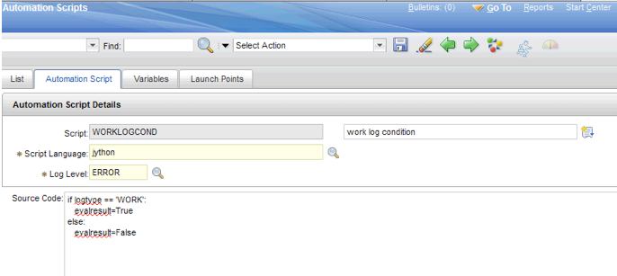
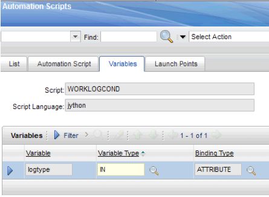
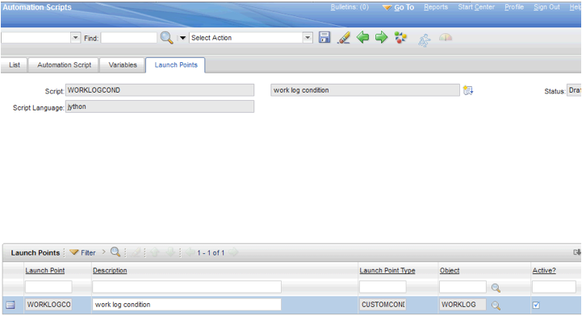
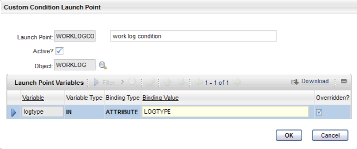
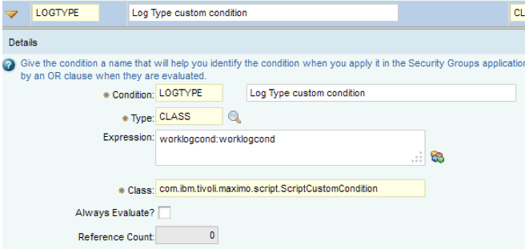

# Automation script for a condition that is based on work log information

This script returns a value of true or false based on the log type that is defined in a custom condition in the Conditional Expression Manager.

### Step 1

In the Automation Scripts application, select the **Create > Script with an Object Launch Point** action.

* On the **Automation Script** tab, copy and paste the following script source:
```kotlin
if logtype == 'WORK':
   evalresult=True
else:
   evalresult=False
```



### Step 2

* On the **Variables** tab, fill in the Script field with <code>WORKLOGCOND</code> variable name and uses the jython script as the Script Language to be used. Also, the Variable Type field must be <code>IN</code> and The Building Type value must as <code>ATTRIBUTE</code>, as shown in the following image: 




### Step 3

* On the **Launch Points** tab, verify the following values are specified: 
- In the **Script** field: <code>WORKLOGCOND</code>
- In the **Script Language** field: <code>jython</code>
- In the **Status** field: <code>Draft</code>
Ensure that the launch point is listed in the "Launch Point" section, as shown in the following image:



* In the "Custom Condition Launch Point" section, select the **Active** checkbox to <code>TRUE</code> and, in the ATTRIBUTE field, specify <code>LOGTYPE</code>. Then, click **OK** to proceed. 



### Step 5

* In the Conditional Expression Manager, create the condition by adding a row where the **Condition** field refers to LOGTYPE and the **Class** field contains the CLASS type. Also, in **Expression** field, paste in the following code:

```SQL
    worklogcond:worklogcond
```
The (Full Qualifiend Name) (FQN) of the Script Custom Condition class is given, and the **Class** field contains the following Java Type:

```java
com.ibm.tivoli.maximo.script.ScriptCustomCondition
```



* The script verifies the values and returns a value of true or false. 
