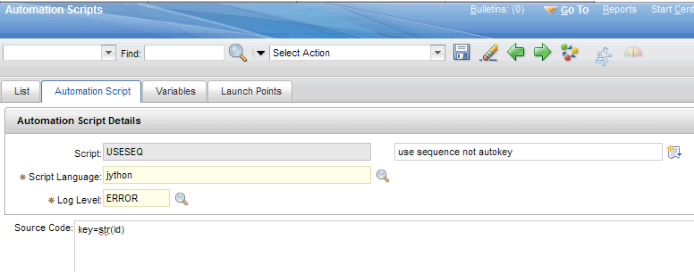
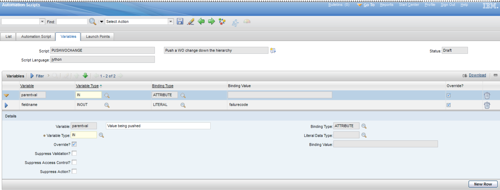
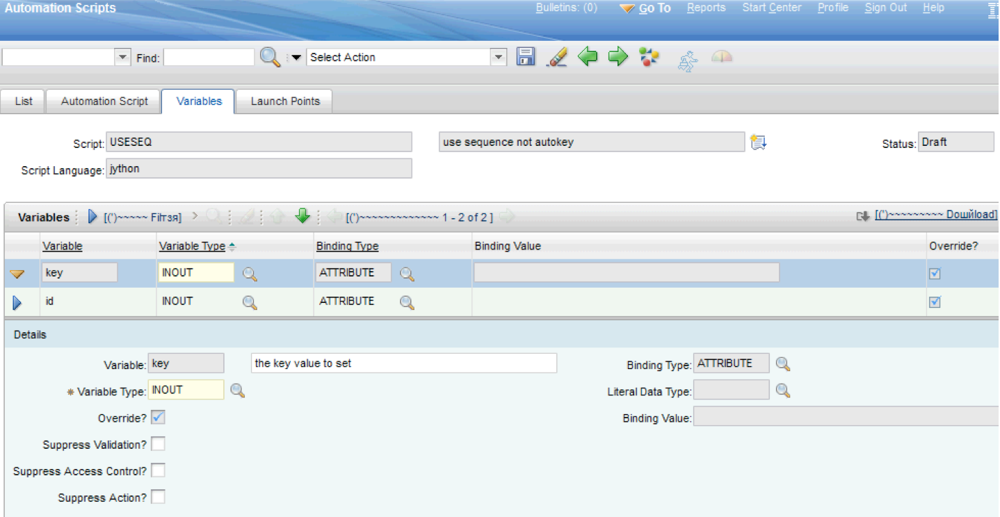
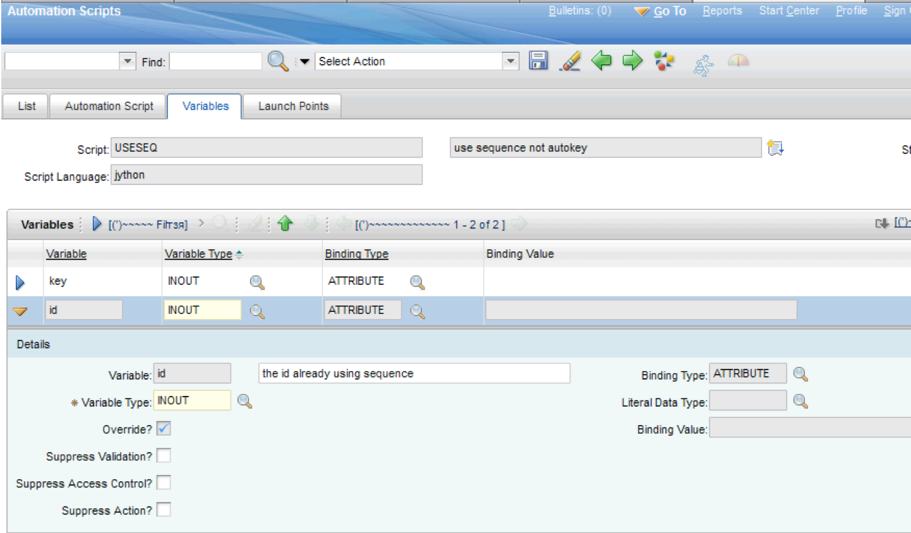
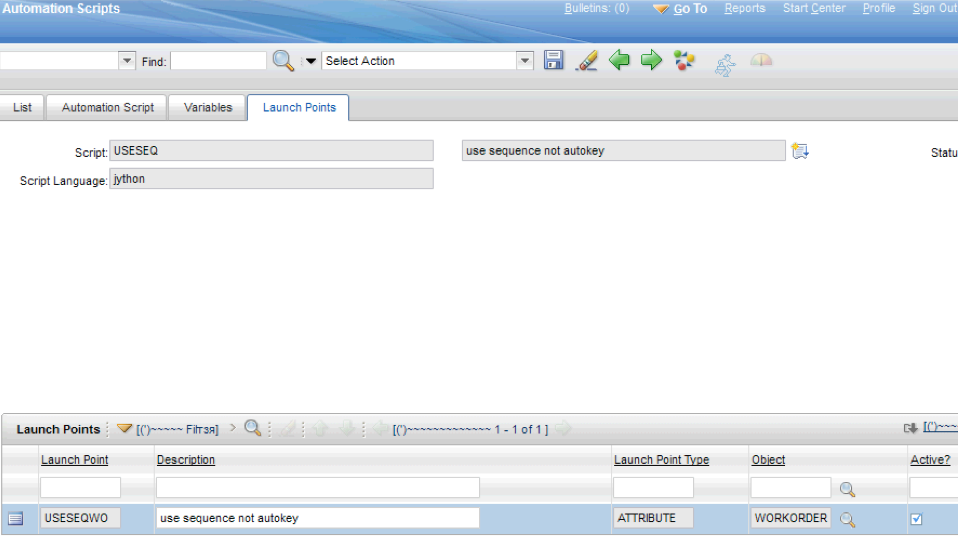
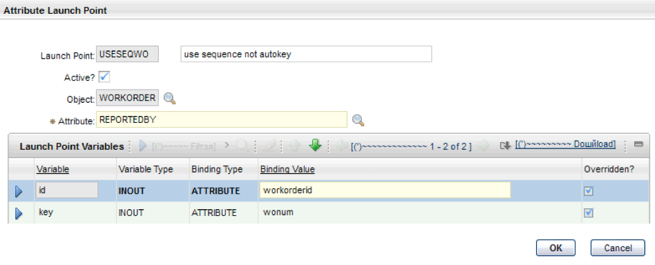

# Automation script to use a sequence instead of an autokey

This script allows for the current unique id sequence to be used to set the record key value instead of using an autokey. Launch points can be created for various objects, such as work orders and tickets, and still use the same script. You can remove the autokey from the field in question. This example uses the **Reported By field** for the launch point, and it is recommended that you use the script for fields that do not require user entry. The script can further be expanded to process differently by site or based on the interactive flag.


### Step 1: Automation Script tab
In the Automation Scripts application, select the **Create > Script with an Attribute Launch Point** action and paste the following script into the **Source Code** field on the **Automation Script** tab

```python
key=str(id)
```


## Step 2: Variables tab

On the **Variables** tab, in the Variables section, expand the <code>parentval</code> variable and fill in the **Variable Type** field with the value <code>IN</code>.



Find the variable <code>key</code>, exapnd it and fill in the **Variable Type** field with the value <code>INOUT</code>.



Also, find the variable <code>id</code>, exapnd it and fill in the **Variable Type** field with the value <code>INOUT</code>, as shown in the following image:




## Step 3: Launch Points tab

On the **Launch Point** Tab, verify that the launch point <code>USESEQWO</code> is listed and activated in the Launch Point section.



Also, at the Attribute Launch Point section, verify that the **Attribute** field is set to <code>REPORTEDBY</code> value and tjat the variables are listed into the Launch Point Variables, as shown in the following image:




