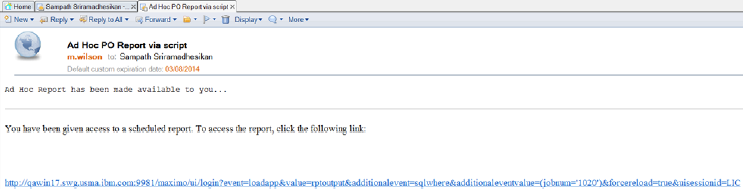
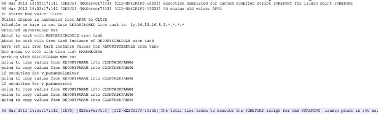
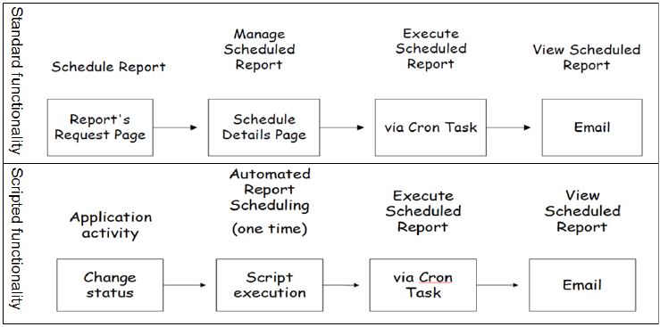

# Automating reports by using automation scripts

Enterprise and on-demand reports are a cornerstone of any Maximo Asset Management implementation. A number of options to view, print, and distribute reports are available in the version 7.5 release of the underlying process automation engine. The report execution is usually triggered from the user interface of the business application, typically, when the user selects the **Run Reports** action from the **Action** menu.
Often, users want to automatically execute the report without having to manually select the **Run Reports** action and set the various report execution options. For example, a user might want to automatically run the report when the record is saved or the status is changed.
The Work Order Tracking application has a feature that executes a report when the status of a particular work order changes. The Change Status window contains a **Print Report** check box checking that triggers report execution and delivers a PDF file to the user’s client workstation as downloadable file. Adding this capability to other business applications requires enhancing the application’s user interface code.
But you can use automation scripts to automate report execution without having to change the business application or its user interface in any way. The following example implements the scenario for the Purchase Order (PO) application.

<face color=RED><b>NOTE:</b> The Jython-based script code is an illustration of report execution that can be triggered by means other than the existing user-interface-based capabilities. It is not intended to be production-quality code, and it is not supported by IBM in any form.</face>

## Scripting report execution
Automation scripting in version 7.5 of the process automation engine is restricted to the business object framework that is executed on the application server. Scripting does not support any facet of the user interface framework except posting error and warning messages, which are also managed from the business object framework.

The immediate execution of a report and the display of the BIRT Report Viewer window is initiated and controlled in the user interface layer of the product and involves URL redirection and servlet use. This capability cannot be scripted. However, you can script the scheduled execution of reports and the sending of report notification to intended recipients. You can also script the preparation of the report schedule configuration in response to a status change in the business application.

This scenario is similar to the **At this Time** option of scheduled report execution.

To learn how to work with Report Execution, click [here](AS07_executeReport_ReportExecution)

## Design

The low-level design of this script does the following tasks:
1. Check for a status change.
2. Create a report schedule record.
3. Create a cron task instance record.
4. Create cron task parameters by copying parameters from the report’s parameter records.
5. Save.

## Recognizing a status change for a purchase order

This scenario triggers report execution when the status of a PO changes to close the PO. An object launch point is used to implement this check and schedule the report execution.

## Capturing the input parameters that are required to schedule report execution

In the absence of a user interface, variables can be used to input the parameters for the report and cron task.

<u>Input variables are listed in the following table:</u>

<table>
<tr>
<th>Variable</th>
<th>Type</th>
<th>Binding</th>
<th>Value</th>
<th>Remarks</th>
</tr>
<tr>
<td>v_appname</td>
<td>IN</td>
<td>LITERAL</td>
<td>PO</td>
<td>The name of the application for which the report is executed. The value is used to generate the file name for the repor and also to locate the report from the available report folders. This value is stored in the REPORTSCHED record.</td>
</tr>
<tr>
<td>v_emailcomments</td>
<td>IN</td>
<td>LITERAL</td>
<td>An ad hoc report has been made available to you...</td>
<td>The text that is added to the message body of the email notification that is sent to recipients when the report is executed. This value is stored in the REPORTSCHED record.</td>
</tr>
<tr>
<td>v_emailfiletype</td>
<td>IN</td>
<td>LITERAL</td>
<td>PDF</td>
<td>The type of the report output file that is attached to the email notification if user has chosen to attach the report. Valid values are ‘PDF’ or ‘XLS’. This value is stored in the REPORTSCHED record.</td>
</tr>

<tr>
<td>v_emailsubject</td>
<td>IN</td>
<td>LITERAL</td>
<td>Ad hoc PO report via script</td>
<td>The text that is set as the subject line of the email notification that is sent to recipients when the report is executed. This value is stored in the REPORTSCHED record.</td>
</tr>

<tr>
<td>v_emailto</td>
<td>IN</td>
<td>LITERAL</td>
<td> 
```kotlin 
<Comma-separated email addresses>
``` 

<td>A comma-separated list of email addresses that the email notification is sent to. Each email address must correspond to a valid person record in the product. This value is stored in the REPORTSCHED record.</td>
</tr>

<tr>
<td>v_emailtype</td>
<td>IN</td>
<td>LITERAL</td>
<td>url</td>
<td>The type of the email notification. Valid values are ‘url’ or ‘attach’. This value is stored in the REPORTSCHED record.</td>
</tr>
<tr>
<td>v_maximourl</td>
<td>IN</td>
<td>LITERAL</td>
<td><Base URL to access the product – usually http://myhost:myport/maximo>
<td>The product base URL that is used to generate a complete URL to access the Report Viewer application. This value is stored in the REPORTSCHED record.</td>
</tr>

<tr>
<td>v_paramdelimiter</td>
<td>IN</td>
<td>LITERAL</td>
<td>||</td>
<td>Specifies the delimiter that is used by the reporting framework to identify internal parameters to run the report with. These values differ from the standard report parameters that are associated with the report design.</td>
</tr>

<tr>
<td>v_paramstring</td>
<td>IN</td>
<td>LITERAL</td>
<td>appHierarchy=PO||displayWhere=</td>
<td>Required report framework internal parameters. The appHierarchy parameter must be set to the application name from where the report execution is scheduled. The displayWhere parameter is a dynamic WHERE clause, and this script does not use the displayWhere parameter, because it uses the identifier of the currently open PO record.</td>
</tr>

<tr>
<td>v_status</td>
<td>IN</td>
<td>ATTRIBUTE</td>
<td>STATUS</td>
<td>The status of the PO.</td>
</tr>

<tr>
<td>v_reportname</td>
<td>IN</td>
<td>LITERAL</td>
<td>poprint.rptdesign</td>
<td>The name of the report to execute. This value is stored in the REPORTSCHED record</td>
</tr>
</table>

From this list of input variables, only the v_status variable is bound to the PO business object’s STATUS attribute. All other variables are used to specify the necessary input parameters to the report scheduling APIs.

## Script code

The sample code for this scenario predominantly relies on Java-based APIs.

## Imports

Several Java package imports are placed at the beginning of the script to invoke APIs.

```python 
...

 from java.util import Calendar
 from java.util import Date
 from psdi.app.report import ReportUtil
 from psdi.server import MXServer
 from psdi.mbo import MBOConstants
 from psdi.mbo import SqlFormat
...

```

The Calendar and Date APIs are used to specify the point in time when the <code>REPORTSCHEDULE</code> cron task executes the report. The ReportUtil methods are used to convert the Date object into a string representation of the time when the cron task executes the report. The MXServer methods are used to retrieve the report schedule, report parameters, crontask definition, crontask instance, and crontask parameter data sets <code>(MBOSets)</code>. A record is created for each report schedule, cron task instance, and cron task parameters. The <code>MBOConstants</code> class is used to specify field flags when setting attribute values on a record <code>(MBO)</code>. The <code>SqlFormat</code> class is used to set up SQL criteria to retrieve the report parameters for the chosen report.

## Implementation Logic

The following script code checks the status change of the PO and verifies that the status is being set to ‘CLOSE’:

```python 
... 

if(str(v_status) != str(v_status_initial)) and v_status=='CLOSE':
    print "Status change in happening from " + str(v_status_initial) + " to " + str(v_status)
...

```
The next sample code sets up a Java Date object that is initialized to 30 seconds from the current system time. This Date object is passed to the ReportUtil’s <code>convertOnceToSchedule()</code> method.

This method accepts three parameters: Date object, Locale object, and TimeZone object. It returns a string that represents the cron task schedule that is accepted by the cron task engine. A Locale object and UserInfo object are retrieved, because they are used later in the script code. Notice that these objects are retrieved from the current MBOSet that the PO record is part of.

```python 
...
    # set a schedule for the report
    c = Calendar.getInstance()
    # add 60 seconds to current time to allow preparing REPORTSCHED cron task instance
    c.add(Calendar.SECOND,30)
    d = c.getTime()
    thisposet = mbo.getThisMboSet()

    if thisposet is not None:
        locale = thisposet.getClientLocale()
        userinfo = thisposet.getUserInfo()
    schedule = ReportUtil.convertOnceToSchedule(d,locale,c.getTimeZone())

    print "Schedule we have to set into REPORTSCHED Cron Task is: " + str(schedule)
...

```

In the next sample code, a new record is added to the <code>REPORTSCHED</code> table. All the required attributes of the <code>REPORTSCHED</code> record are set. Some of the attributes are not required but are still set, such as the  <code> COUNTRY </code> attribute and <code>VARIANT</code> attribute to ensure locale-sensitive handling, the <code>EMAILCOMMENTS</code> attribute and <code>EMAILSUBJECT</code> attribute to enable configurability of the email that is sent to recipients, and the <code>MAXIMOURL</code> attribute so that a link to the executed report can be included in the email.

```python
...

   if scheduler is not None:
        reportschedset = MXServer.getMXServer().getMboSet("REPORTSCHED",userinfo)
        if  reportsched is not None: 
              print "Obtained REPORTSCHED set"
            reportsched = reportschedset.add()
            reportsched.setValue("REPORTNAME" , v_reportname)
            reportsched.setValue("appname" , app)
            reportsched.setValue("USERID" , userinfo.getUserNamer())
            reportsched.setValue("TYPE" , "once")
            reportsched.setValue("EMAILTYPE" , v_emailtype)
            reportsched.setValue("MAXIMOURL" , v_maximourl)
            reportsched.setValue("EMAILUSERS" , v_emailto )
            reportsched.setValue("EMAILSUBJECT" , v_emailsubject)
            reportsched.setValue("EMAILCOMMENTS" , v_emailcomments)
            reportsched.setValue("EMAILFILETYPE" , v_emailfiletype)
            reportsched.setValue("COUNTRY" , locale.getCountry())
            reportsched.setValue("LANGUAGE" , locale.getLanguage())
            reportsched.setValue("VARIANT" , locale.getVariant())
            reportsched.setValue("TIMEZONE", thisposet.getClientTimeZone()getId())
            reportsched.setValue("LANGCODE",userinf.getLangCode())

...

```

The code might be made more robust by checking that input parameters to the script, which are represented by the <code>v_ naming</code> convention, are not null.

Also notice that some of the values that are stored in the <code>REPORTSCHED</code> record are conveniently retrieved from the script framework itself by using the “app” implicit variable or by using previously retrieved objects, such as the UserInfo object and the Locale object.

After the <code>REPORTSCHED</code> record is prepared, the next step is to create a <code>CRONTASKINSTANCE</code> record for the <code>REPORTSCHEDULE</code> cron task. When storing values in the <code>CRONTASKINSTANCE</code> record, the instance name is set to a numeric value that is a function of the current date and time. The <code>RUNASUSERID</code> parameter is set to the currently logged in user. The <code>AUTOREMOVAL</code> flag is set to <code>“True”</code>, which indicates that this cron task instance is automatically deleted after report execution. The sample code also retrieves the cron task name and instance and links back to the <code>REPORTSCHED</code> record so that the reporting framework can find the scheduling details for the cron task when it begins execution.

```python 
    ...
    print "About to work with Cron task instance of REPORTSCHEDULE cron task"
    crontaskinst = crontaskinstset.add(MboConstants.NOACCESSCHECK | MboConstants.NOVALIDATION_AND_NOACTION)
	    if crontaskinst is not None:
			d = Date()
			crontaskinstname = str(d.getTime())
			crontaskinst.setValue("CRONTASKNAME","REPORTSCHEDULE",MboConstants.NOACCESSCHECK | MboConstants.NOVALIDATION_AND_NOACTION)
		    crontaskinst.setValue("INSTANCENAME",crontaskinstname,MboConstants.NOACCESSCHECK | MboConstants.NOVALIDATION_AND_NOACTION)
			crontaskinst.setValue("SCHEDULE",schedule,MboConstants.NOACCESSCHECK | MboConstants.NOVALIDATION_AND_NOACTION)
			crontaskinst.setValue("ACTIVE",1,MboConstants.NOACCESSCHECK | MboConstants.NOVALIDATION_AND_NOACTION)
			crontaskinst.setValue("RUNASUSERID",userinfo.getUserName(),MboConstants.NOACCESSCHECK | MboConstants.NOVALIDATION_AND_NOACTION)
			crontaskinst.setValue("HASLD",0,MboConstants.NOACCESSCHECK | MboConstants.NOVALIDATION_AND_NOACTION)
			crontaskinst.setValue("AUTOREMOVAL",True,MboConstants.NOACCESSCHECK | MboConstants.NOVALIDATION_AND_NOACTION)
			print "have set all cron task instance values for REPORTSCHEDULE cron task"
	reportsched.setValue("CRONTASKNAME",crontaskinst.getString("CRONTASKNAME"))
	reportsched.setValue("INSTANCENAME",crontaskinst.getString("INSTANCENAME"))
    ...
    
    # Refer to the script attached to this sample for futher information
...

```

The final section of code is used to preprare the parameters for the cron task instance. To set up those cron task parameters, the code must retrieve report parameters for the chosen report from the <code>REPORTPARAM</code>. Those parameters are retrieved into the "reportparamset" object. The code then iterates through these parameters and stores them in a new <code>CRONTASKPARAM</code> record. At the end, the code retrieves the unique ID column name and value from the current PO record so that the report is run for that particular PO record. 

Finally, the "reportschedset" object is saved, which results in the <code>REPORTSCHED</code>, <code>CRONTASKINSTANCE</code> and <code>CRONTASKPARAM</code> records being saved.

When this script is saved, the launch point is active.


## Testing

Testing this script is straightforward.

1. Create a purchase order. Add lines and save.
2. Move the purchase order through the typical status changes.
3. Close the purchase order. Watch for the navigation bar confirmation message that the PO was set to status CLOSE.
4. Quickly access the <code>REPORTSCHEDULE</code> cron task in the Cron Task Setup application. Filter the Access Level to <code>READONLY</code> to find this cron task.
5. Notice that a new cron task instance is associated and cron task parameters are shown that contain the unique ID of the PO that you just closed.
6. Wait for a short duration of time, such as a couple of minutes, to allow the cron task to execute the report.
7. If you configured a mail client to receive the email notification from Maximo Asset Management, look for a new email in the inbox of the client that looks similar to the <b>Figure 4</b>:


<center><font size=1><b>Figure 4</b> Email set up notification</font></center>

8. Click the link to return to the product environment. The Report Viewer application shows one entry that corresponds to the purchase order that you just closed. You can download the PDF file or XLS spreadsheet by using the Download Content link for the entry.

## Logging

As with any automation script, testing in a development environment is best practice before the script and launch point are promoted to other environments. A few print statements in the body of the script can help trace execution. These print statements, when combined with the DEBUG log level of the scripting framework, can help you get useful execution information from the product log files:


<center><font size=1><b>Figure 5</b> Logging sample</font></center>


## Things to remember
1. If report execution is no longer needed when a purchase order is closed, you can deactivate the launch point.
2. The launch point for this script code runs only for the PO business object. If you would like to implement this code for a different object, then you must prepare a new launch point for that object.
3. The script code is itself generic enough to run against any main business object and business application that have reports associated with them. Some clean up is required, because fragments of the code refer to PO, such as variable names and print statements.
4. The variable binding values that are associated with the launch point also require change if a different business object and application are  targeted.
5. The launch point will not run when Admin Mode is active.
6. Depending on the load on the cron task Java virtual machine, the actual execution of report can vary by a very small fraction of time. Similarly, email delivery times can vary based on the mail server configurations.
7. The code samples are not production-quality code.
8. In the code, an assumption is made that the logged in user who is also set as the <code>REPORTSCHEDULE</code> cron task’s Run As user has sufficient authorizations to successfully execute the report. If this assumption is not always true, an IN variable can be added to store the desired Run As user’s ID.
9. The launch point and script code are designed to execute the desired report for the current PO record. Other types of reports for the Purchase Order application, such as the Vendor Performance report, cannot be executed with this script. These reports do not use a particular PO as a parameter.

## Summary
The approach that is described in this topic show how scripting can be adapted to report execution. Knowledge of the scheduling capabilities of the reporting framework was a prerequisite to providing an implementation. The solution also shows how multiple product configurations, including report design, parameters, cron tasks, and cron task instances, are linked together to deliver functionality to end users.
You can see the difference in the standard scheduled report execution versus the scripted report execution sequence in <b>Figure 6</b>:


<center><font size=1><b>Figure 6</b> Scripted report execution sequence</font></center>

The key difference is that in the scripted approach, report execution is scheduled automatically in response to an application event.

## Useful Links

[Application Report display configurations](http://www.ibm.com/developerworks/wikis/display/maximo/Administering+Reports+-+Application+Report+Display+Configurations)

[Report features guide](http://www-01.ibm.com/support/docview.wss?uid=swg21498433)
(Refer the Report Scheduling section on page 36)

[Tpae automation scripting cookbook](http://ibm.co/pPl32E)

## Files accompanying this article

[PO Script Sample](sample07/POscript.py)
