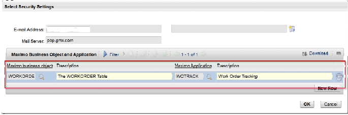
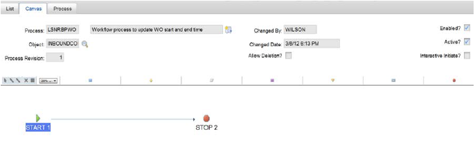
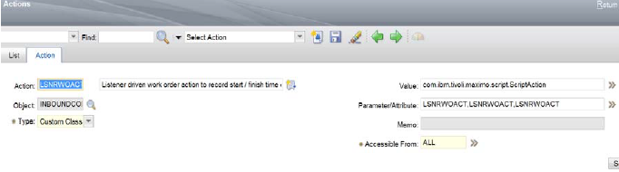
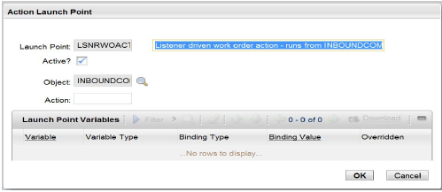
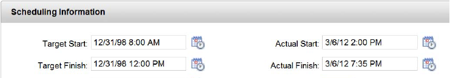

 # Implementing action-based scripts to process incoming emails and act on business objects

 # Email listener to update the actual start and finish dates for a work order

<face coloar=RED> <b>NOTE:</b> This information is provided as-is. The code that was created for this scenario was tested with Maximo Asset Management version 7.5.0.1 using MAXDEMO database. </face>

## Requirements

Adapt Maximo’s email listener functionality to process email notifications that contain updates to work order fields, specifically, actual start and finish dates.

## Assumptions
1. Maximo Asset Management version 7.5 or higher
2. Sender that is composing email uses the formatted email capability and syntax that are used by Maximo Asset Management
3. The email listener treats all incoming emails to the particular email account as updates to existing work orders
4. The email listener processes email content for the following fields:
    A. <code>WONUM</code> – work order number, primary key on <code>WORKORDER</code> MBO
    B. <code>SITEID</code> – work order site, also primary key on <code>WORKORDER</code> MBO
    C. <code>ACTSTART</code> – actual start date of the work order recorded in the format: 03/06/12 2:00 PM
    D. <code>ACTFINISH</code> – actual finish date of the work order also recorded in the same format

## Approach

The following items are used to implement this requirement:
1. A dedicated email listener that processes all incoming email from an account as work order updates
2. A dedicated workflow process that launches the necessary actions to process work order updates from email
3. A dedicated scripted action that is launched from the workflow process and that retrieves the <code>ACTSTART</code> and <code>ACTFINISH</code> dates from the email and updates the correct work order
4. An extension to existing email listener functionality: The email listener pulls up the email from the mail account and loads its content into the <code>INBOUNDCOMM</code> staging table. The Listener parser functionality already extracted the contents of the formatted email and prepared a simple data structure holding fields and their values.

## Email Listener set up

1. Create a test email account and configure an email listener to monitor that email account. Link this listener to the dedicated workflow process. Set up security authorization for this particular email listener for the Work Order Tracking application in Maximo Asset Management. The email listener runs under the “MAXADMIN” account ,and this administrative account has update authorization for the Work Order Tracking application. See <b>Figure 1</b>:


<center><font size=1><b>Figure 1</b> WO Track Authorization</font></center>

2. Create a workflow process that is named LSNRBPWO, which indicates its use with Work Orders. The workflow process is defined for the INBOUNDCOMM MBO. This MBO manages the staging table for all incoming email. Other email accounts might be processed by other listeners. All listeners share the same INBOUNDCOMM staging table. The workflow process contains just a Start and Stop nodes and a connecting line. The scripted action on the connecting line is all that is needed to drive the work order update logic. IMPORTANT: This workflow must be enabled and active to be used in Email Listener. <b>Figure 2</b>:


<center><font size=1><b>Figure 2</b> Enable to be used (Email Listener Application)</font></center>

3. The action, <code>LSNRWOACT</code>, is specified as shown in <b>Figure 3</b>:


<center><font size=1><b>Figure 3</b> Configure Action LSNRWOACT</font></center>

4. The name <code>LSNRWOACT</code> is used for the action, the action launch point and the script itself. In the Actions application, no work is required. In the Automation Scripts application, defining an action launch point automatically generates the action and links the action to the action launch point. 


<center><font size=1><b>Figure 4</b> Configure Action Type</font></center>

The Action Type is Custom Class in <b>Figure 4</b>. The class reference is supplied in the **Value** field. Do not edit the prepopulated values in the **Parameter/Attribute** field.

5. The action launch point <code>LSNRWOACT</code> is defined by using the action launch point wizard in the Automation Scripts application. The MBO to target is <code>INBOUNDCOMM</code>. No input or output variables are defined currently. Remember, everything in this implementation operates against the <code>INBOUNDCOMM</code> table, not against <code>WORKORDER</code>. The script code <code>ALONE</code> operates against <code>WORKORDER</code>. <b>Figure 5</b>:


<center><font size=1><b>Figure 5</b> The Launch Point </font></center>

IMPORTANT: The **Launch Point Active** check box controls whether or not the launch point AND script execute. If unselected, the script is not run. Ignore the **Status** field in the Automation Scripts application, because it has no effect on the launch point.

6. The following script <code>LSNRWOACT</code> is created in the multi-line text editor. 

```python

...

from java.util import Hashtable
from java.util import Date
from java.text import SimpleDateFormat
print '$$SAM$$ - entering LSNRWOACT action'
# COMMENT: from the INBOUNDCOMM MBO retrieve all of the attributes and values in the body of the email
attrhashtable = mbo.getAttrHash()
print '$$SAM$$ - total elements in hashtable: ' + str (attrhashtable.size())
dynclause = ''
actualstartdate = attrhashtable.get('ACTSTART')
print '$$SAM$$ - actual start date from email is:' + str(actualstartdate)
actualfinishdate = attrhashtable.get('ACTFINISH')
print '$$SAM$$ - actual finish date from email is:' + str(actualfinishdate)
dynclause = 'WONUM=' + "'" + attrhashtable.get('WONUM') + "' and " + 'SITEID=' + "'" + attrhashtable.get('SITEID') + "'"
print '$$SAM$$ - where clause is: ' + dynclause
woset = mbo.getMboSet("$lsnrwoset","WORKORDER",dynclause)
# now use the keys to lookup the specific WO record
woset.setQbeExactMatch("true")
woset.reset()
wocount = woset.count()
print '$$SAM$$ - total work order records found is: ' + str(wocount)
if wocount>0:
wo = woset.getMbo(0)
if wo is not None:
sdf = SimpleDateFormat ("MM/dd/yyyy hh:mm aaa")
date_actstart = sdf.parse(actualstartdate)
print '$$SAM$$ - formatted date is : ' + date_actstart.toString()
wo.setValue ("ACTSTART",date_actstart)
date_actfinish = sdf.parse(actualfinishdate)
print '$$SAM$$ - formatted date is : ' + date_actfinish.toString()
wo.setValue ("ACTFINISH",date_actfinish)
print '$$SAM$$ - leaving LSNRWOACT action'

...


```

## Explanation for the code
* The Email Listener maintains a HASH (data structure) of the attributes and values that are specified in the body of the formatted email. 
* The code must generate date  and time information and set it into the Work Order object for Maximo Asset Management to save.
* The first important step in the code is to retrieve the HASH of attributes and values by calling <code>mbo.getAttrHash()</code>. MBO is a special keyword, and placing this keyword in the script allows the script code to work against the current MBO that is the <code>INBOUNDCOMM</code> record we want to process. The getAttrHash() method is public in the Inboundcomm MBO and is used to retrieve the data structure.
* The code retrieve the desired values from by using Hashtable methods. <code>ACTSTART</code>, <code>ACTFINISH</code>, <code>SITEID</code> and <code>WONUM</code> are retrieved. This listener is geared to processing actual start and finish times. The work orders primary key information must be supplied in the email. This processing leads to a set of <code>attrhashtable.get()</code> calls.
* A SQL WHERE clause that uses string formatting is used in the the dynclause variable dynclause.
* A work order data set (MBO set) is created from the current <code>INBOUNDCOMM</code> MBO by using a standard Java method that is called <code>getMboSet()</code>. This method accepts 3 parameters:
    1. Name of the MBO set – a unique name - $lsnrwoset
    2. Name of the MBO – WORKORDER
    3. Where clause used to retrieve the desired records – dynclause variable is used
* The  <code>setQbeExactMatch()</code> method is called on the work order data set with parameter <code>“true”</code>. If this is not done, Maximo Asset Management executes a wildcard search and returns multiple work order.
* The work order data set is reset to force retrieval of data from the database.
* The count of returned records is checked. 
* That single record is retrieved into the variable ‘wo’.
* The last few lines of code use the Java SimpleDateFormat class to convert the string value that is retrieved from the email and set.

The code in this sample is complete but requires testing. To aid in debugging, a few Jython print statements are used in the code. These print statements are linked to a LOG LEVEL of DEBUG, and after the ‘autoscript’ logger (in Logging application) is also set to DEBUG, the output of those statements shows up in the log file, for example:

```kotlin 
15 Dec 2012 21:23:17:879 [DEBUG] [MXServer] [CID-MXSCRIPT-1300] execution completed for cached compiled script LSNRWOACT for launch point LSNRWOACT
15 Dec 2012 21:23:17:879 [DEBUG] [MXServer] [CID-MXSCRIPT-1300] $$SAM$$ - entering LSNRWOACT action
$$SAM$$ - total elements in hashtable: 4
$$SAM$$ - actual start date from email is:03/06/12 2:00 PM
$$SAM$$ - actual finish date from email is:03/06/12 7:35 PM
$$SAM$$ - where clause is: WONUM='1001' and SITEID='BEDFORD'
$$SAM$$ - total work order records found is: 1
$$SAM$$ - formatted date is : Sun Mar 06 14:00:00 EST 12
$$SAM$$ - formatted date is : Sun Mar 06 19:35:00 EST 12
$$SAM$$ - leaving LSNRWOACT action
15 Dec 2012 21:23:17:880 [INFO] [MXServer] [CID-MXSCRIPT-1300] The total time taken to execute the LSNRWOACT script for the LSNRWOACT launch point is 57 ms.
```
As can be seen from the log statements, very basic processing is incorporated in the script to retrieve the dates from the email and set them into the right work order record.

The Maximo action framework handles saving automatically. The work order data set must be grouped into the same transaction as was used by the <code>INBOUNDCOMM</code> data set. Putting both data sets in the same transaction keeps things simple.

What does the work order email look like?
The following example shows a simple formatted email that can be used to test this code:

#MAXIMO_EMAIL_BEGIN
    LSNRACTION=UPDATE
    ;
    LSNRAPPLIESTO=WORKORDER
    ;
    WONUM=1001
    ;
    SITEID=BEDFORD
    ;
    ACTSTART=03/06/12 2:00 PM
    ;
    ACTFINISH=03/06/12 7:35 PM
    ;
#MAXIMO_EMAIL_END

The email must be composed exactly as shown above. The actual start and finish date values and the work order number and site ID values can be plugged into the right of the equals sign as required. 

After the email listener runs, it finds and updates the work order, which then displays the values in the application as shown:


<center><font size=1><b>Figure 6</b> After email listener run </font></center>

# Improvements
1. I did not implement any error handling. Code that’s written to go into an actual implementation would have to be more robust than this.
2. I kept my code simple to operate with just primary keys of work order and the actual start and finish dates. If additional fields should also be processed, more code would have to be added.
3. I did not break down the code into functions. If the complexity of the implementation increases and more code is required, we would have to break it into functions for improved readability.
4. I have set the date pattern as ‘MM/dd/yyyy hh:mm aaa’. You can check any number of Java web sites to determine if there’s better pattern you can work with. I have found Maximo to be sensitive to date and time strings. I picked something that I found Maximo can accept. Another option is not to hold the date pattern inside the code. You could declare an IN variable for the Action launch point and bind that variable to the literal date pattern. This way, if you want to play with different date patterns you simply change the launch point bind values without actually changing the code.