# Creating and importing automation scripts by using the user interface

After reading this document, you will know which events you can select when creating attribute launch points in Maximo Asset Management and how to import a .py script into the Automation Scripts application. 

The following events are available when you create the attribute launch point:

The **Initialize Value** event is used to initialize the attribute for new records.
    
The **Initialize Access Restriction** event is used to set an attribute as required or read-only when first the application is first accessed.
    
The **Validation** event is used to validate the attribute. Do not add new variables to include business logic here.
    
The **Run Action** event is used for all business logic that is associated with the attribute. Do not try to do validation here. 

The **Retrieve List** event is used when a domain is associated with the attribute.


## Requirements and samples 

The following requirements are used in this example:

Requirement 1: A vendor is required when the asset type is Production in the Run Action event.

Requirement 2: The purchase price must be between $20 - $20000 in the Validate event.

Requirement 3: The replacement cost is always be one-half of the purchase price in the Run Action event.

### Steps:

1. Open the Automation Scripts application.

From the action menu, click **Create** and select the **Script with Attribute Launch Point** action.


2. Specify values in the **Launch Point**, **Object**, and **Attribute** fields.

Select the **Validate** event.


Click **Next**.

3. Enter a name for the script and change the script language to 'jython'.

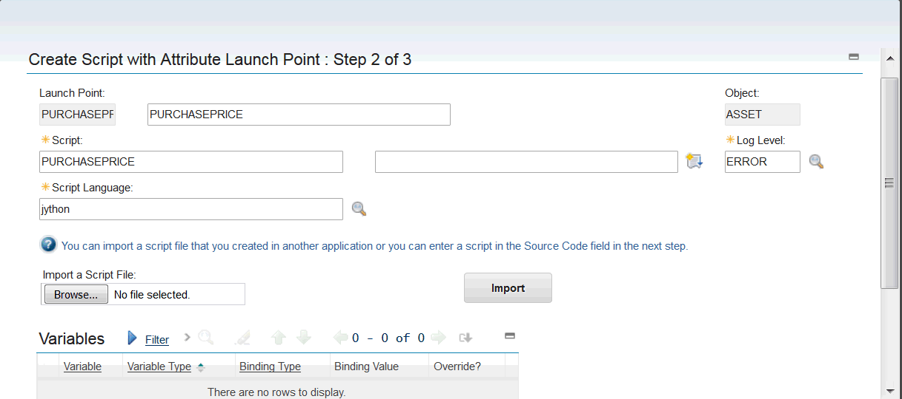

Enter the following code in the **Source Code** field:
```python
from psdi.util import MXApplicationException
if purchaseprice < 20 or purchaseprice > 20000:
errorgroup = 'custom'
errorkey = 'outofrangeprice'
```


**Note:** THe errorgroup and errorkey lines must be indented, which is shown in the following image:

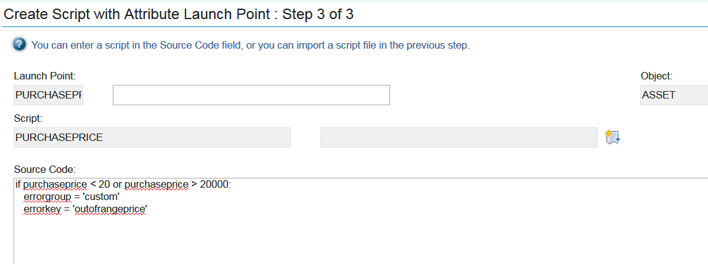

Click **Next**.

A system message is displayed.

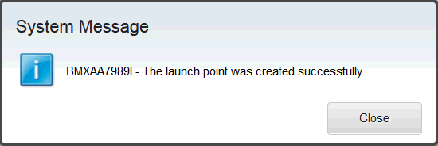

Click **Close**.

4. Open the Database Configuration application.
Select the **Messages** action and click the **New Row** button.
Specify values in the **Message Group**, **Message Key**, **Message ID Prefix**, and **Value** fields, as shown in the following image:

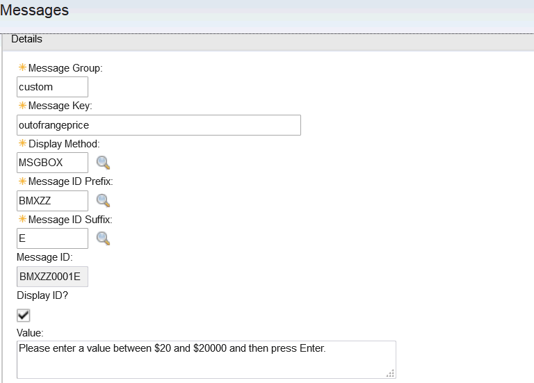

Click **OK**.

5. Open the Automation Scripts application.
From the action menu, click **Create**" and select the **Script with Attribute Launch Point** action.

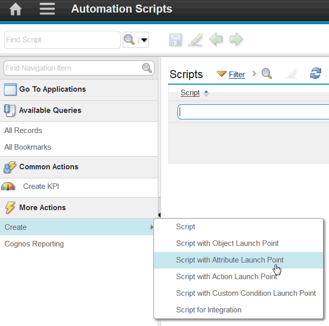

6. Specify values in the **Launch Point**, **Object**, and **Attribute** fields and select the **Run Action** event.

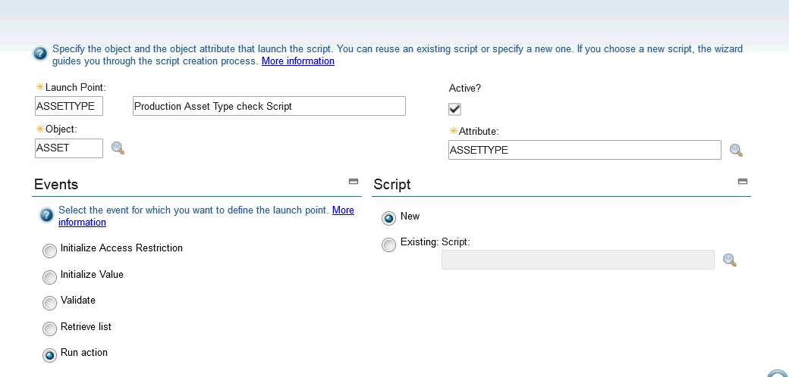

Click **Next**.

7. Click the **New Row** button to create another variable.
Specify values in the **Variable**, **Variable Type**,**Binding Type** and **Launch Point Attribute** fields. In this example, the values are <code>assetType</code> in the **Variable** field, <code>INOUT</code> in the **Variable Type** field, <code>ATTRIBUTE</code> in the **Binding Type** field, and <code>ASSETTYPE</code> in the  the **Launch Point Attribute** field, as shown in the following image:

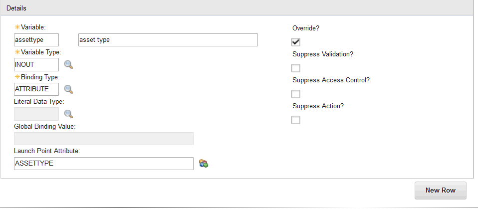

8. Click the **New Row** button to create another variable.
Specify values in the **Variable**, **Variable Type**, **Binding Type**, and **Launch Point Attribute** fields. In this example, the values are <code>vendor</code> **Variable** field, <code>INOUT</code> in the **Variable Type** field, <code>ATTRIBUTE</code> in the **Binding Type** field, and <code>VENDOR</code> in the **Launch Point Attribute** field, as shown in the following image:

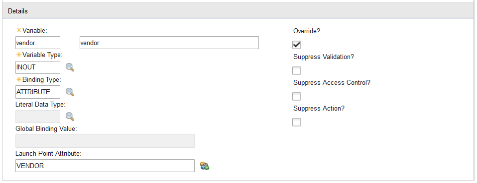

Click **Next**.

9. Enter the following source code:

```python
if assettype_internal=="PRODUCTION":
vendor_required=True
else:
vendor_required=False
```

**Note:** The _internal is an implicit variable that indicates that the asset type field is associated to a synonym domain.
The _required is an implicit variable for setting mandatory fields.

Your Source Code screen looks like the following image:

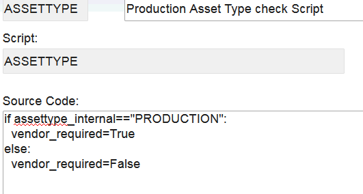

Click **Create** to create the launch point.
A system message is displayed.

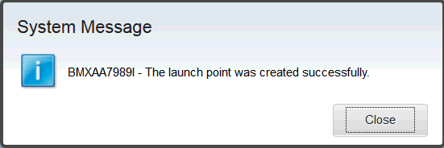

Click **Close**.

10. From the action menu, click **Create**" and select the **Script with Attribute Launch Point** action.

Specify values in the **Launch Point**, **Object**, and **Attribute** fields and select the **Run Action** event.

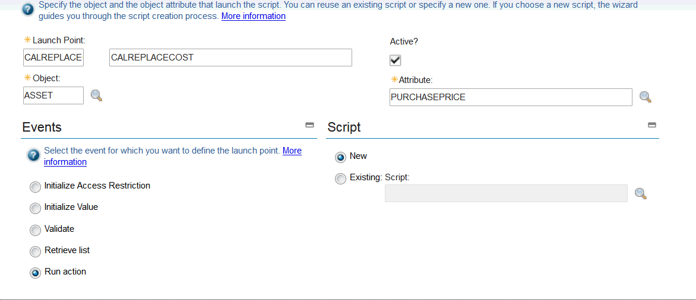

Click **Next**.

11. Click the **New Row** button to create another variable.
Specify values in the **Variable**, **Variable Type**, **Binding Type**, and **Launch Point Attribute** fields. In this example, the values are <code>replacecost</code> in the **Variable** field, <code>INOUT</code> in the **Variable Type** field, <code>ATTRIBUTE</code> in the **Binding Type** field, and <code>REPLACECOST</code> in the**Launch Point Attribute** field, as shown in the following image:

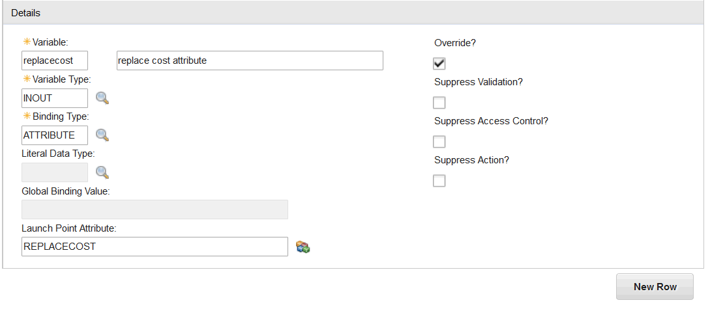

Click **Next**.

12. Enter a name for the script and enter the following source code:

```python
if purchaseprice > 200:
replacecost = purchaseprice/2
```

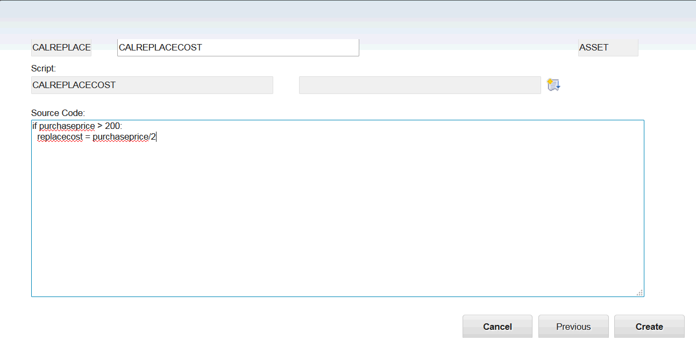

Click **Create**.
A system message is displayed.

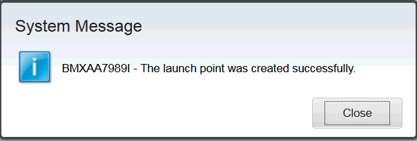

Click **Close**.

All three attribute launch points are created.

## Testing the attribute launch points


### Steps:

1. In the Assets application, open an existing asset.
2. Enter "Production" for the asset type.

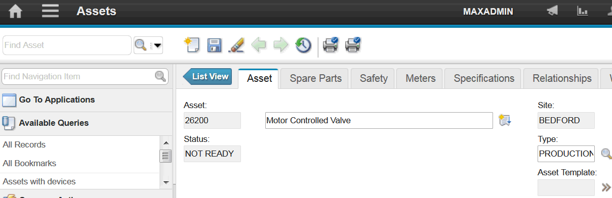

3. Scroll down to check the **Vendor** field.
Because the asset type is "PRODUCTION", the vendor field is mandatory as required by the "ASSETTYPE" attribute launch point.
You can see that the **Vendor** field has an asterisk to indicate that it is a required field.

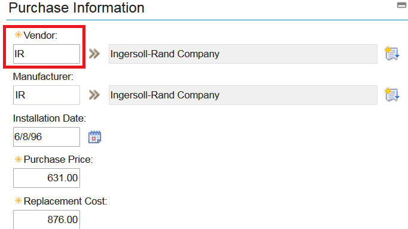

4. In the **Purchase Price** field, enter 1000 and tab out of the field.

Because the purchase price exceeds 200, the Replacement Cost value is changed to 500. which is half of the purchase price as required by the "CALREPLACECOST" attribute launch point.

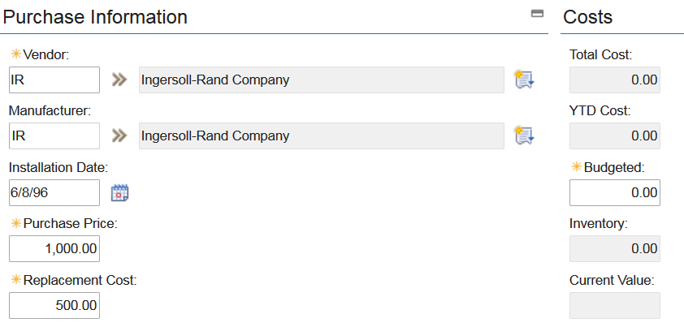

5. In the **Purchase Price** field, enter 50000.

Click on the red cross to see the following error message: "BMXZZ0001E - Please enter a value between $20 and $20000 and then press Enter."

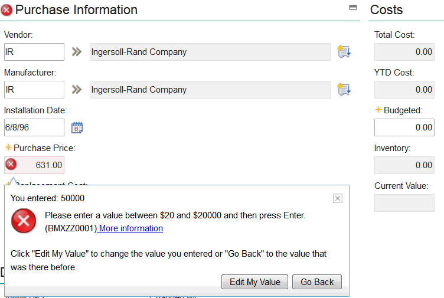

Now you must click the **Edit My Value** button and enter a cost between $20 and $20000 as required by the "PURCHASEPRICE" attribute launch point.
