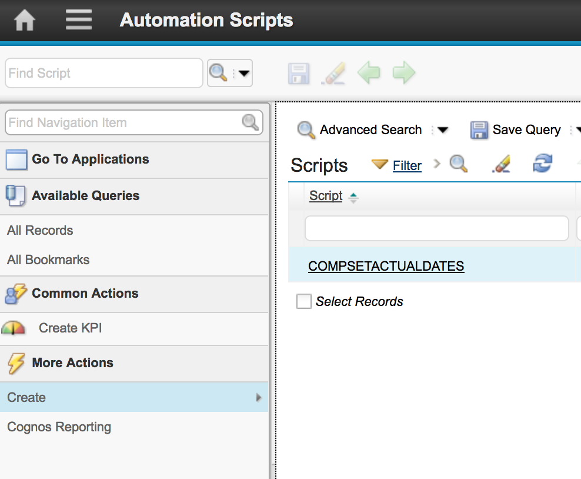
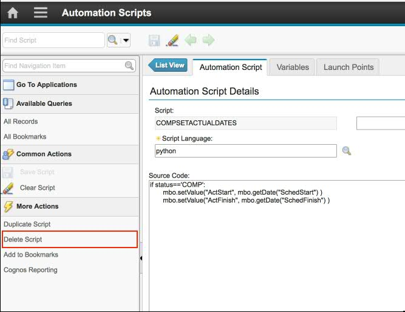

# Exporting and importing automation scripts by using a database configuration (dbc) file

## Introduction 

This document is a **Work in Progress**

This document is not intended to be a substitute for the official Maximo API documentation. If any contradiction is present, you must consider the official documentation as the source of truth.

You must have a basic knowledge about Maximo Asset Management and development, mainly Java, XML, and HTTP requests. You must be also familiar with Maximo applications and modules. 

This tutorial guides you through instructions to help you in export a sample automation script into a dbc file and them import it again by using the <code>runscript.sh</code> command line tool. 

## Skill requirements

* You **MUST HAVE** knowledge of Maximo instrumentation tools. 
* You **MUST HAVE**  knowledge in how to work with command line instructions on Maximo Asset Management. 
* You **MUST KNOW** about the application server and Maximo deployment structure to easily localize the generated scripts by using the create.bat script file. 
* This document will be executed in MAC OS that uses a UNIX-based operating system. 
* You know how to use a terminal and how to handle the command prompt, particularly how to execute commands and navigates through directories on the file system.

## Software requirements 

* You **MUST HAVE** an instance of Maximo Asset Managenet version 7.5 or later. 
* You must know about the <code>MAXIMO_HOME</code> and <code>MAXIMO_CLASSPATH</code> variables. 
* You also know about the <code>JAVA_HOME</code> and <code>CLASSPATH</code> variables.

## For this sample 

You must have executed the [Schedule Dates](AS01_scheduleDates.md) sample in order to have a script to export and import. 

## Import and export an automation script from a dbc file

You can set up the environment to start using the tool to import or export an automation script into a dbc file.
Recently, the latest version of Maximo Asset Management added the <code>psdi.tools.DBCConverter</code> tool, which includes the addition of some parameters that you can use to import and export an automation script to several different extensions. The following parameters are used to export the automation scripts:

<table border='1'>
<tr><td>-sSCRIPT</td><td>The source automation script.</td></tr>
<tr><td>-n</td><td>The name of the automation script.</td></tr>
<tr><td>-y</td><td>Add delete statement before insert.</td></tr>
<tr><td>-f</td><td>The file name. Must end with .ora, .sqs, .db2, .sql, or .dbc. <b>For dbc scripts use .dbc</b></td></tr>
<tr><td>-h</td><td>The host name - if unspecified, localhost is used.</td></tr>
<tr><td>-u</td><td>The user in form of a valid e-mail account name.</td></tr>
<tr><td>-p</td><td>The password for the user.</td></tr>
<tr><td>-t</td><td>The tenant code - value must be the tenant code for consultant users in multi-tenancy.</td></tr>
</table>

## Tips for this documentation

Use the following tips to improve your experience:

### Create a automation script by using the UI 

Complete the steps in [Schedule Dates](AS01_scheduleDates.md) to ensure that you have a script activated in Maximo Asset Management.

### Know your environment 

Locate the area on the server where the scripts are generated. 

For example, if you are following a standard installation for domains in the WebLogic Application Server, all the outputs from the converted script file are extracted into the following directory:

```
[WEBLOGIC_HOME]\user_projects\domains\[MAXIMO_DOMAIN]\[EXPORTED_SCRIPT]
```

Another folder that is named **script** will be created in this folder to store the exported scripts from Maximo Asset Management.

## Exporting an automation script into a dbc file 

### Prerequisites

* The steps in [Schedule Dates](AS01_scheduleDates.md) MUST BE executed. 

To check if the required sample was successfully executed, complete the following steps: 

1. In the Maximo Asset Management Start Center, select **Go To > System Configuration > Platform Configuration > Automation Scripts**.  
2. On the **List** tab, filter by script using the pattern <code>COMPSETACTUALDATES</code> or the given name for the executed sample. 




# Steps to export an automation script into a .dbc file

1. Open a command prompt or terminal. 
2. Navigate to the following directory: /[MAXIMO_HOME]/tools/maximo/internal 
3. Run the following command to extract the automation script in a dbc file: 

```
 $JAVA_HOME/bin/java  -cp "../classes:$MAXIMO_CLASSPATH:mail.jar:/$MAXIMO_HOME/applications/maximo/lib/*:." psdi.tools.DBCConverter -sSCRIPT -n"COMPSETACTUALDATES" -y1 -fcompsetactualsdates.dbc -umaxadmin -pmaxadmin -hlocalhost -t01
 ```

 **Note**: Depending on your environment, the slash representation and commands change whether you're using a UNIX-based operating system or a Windows-based operating system.

The automation script <code>COMPSETACTUALDATES</code> is extracted into a .dbc file. The dbc file is available in the root folder of your  WebLogic Server application domain. (i.e /WEBLOGIC_HOME/user_projects/domains/maximo)


## Importing a dbc file into the Automation Scripts application

### Prerequisites

* For this example, you must delete the script that was generated from the [Schedule Dates](AS01_scheduleDates.md) sample by following these steps:

1.  In the Maximo Asset Management Start Center, select **Go To > System Configuration > Platform Configuration > Automation Scripts**.  
2. Filter the **Script** field to find the automation script <code>COMPSETACTUALDATES</code>.
3. Select the <code>COMPSETACTUALDATES</code>. 
4. From the action menu, select **Delete Script**. 



5. On the main tab of the Automation Scripts application, ensure that the <code>COMPSETACTUALDATES</code> script was deleted successfully. 


# Steps to import an automation script from a .dbc file

1. Open a command prompt window. 
2. Use the following commands to navigate to the [MAXIMO_HOME]\tools\maximo\internal directory: 
```
yourmachine-mbp:echo $MAXIMO_HOME
/maximo
yourmachine-mbp:~ user$ cd $MAXIMO_HOME
yourmachine-mbp:maximo user$ cd tools/maximo/internal/
yourmachine-mbp:internal user$ 
 ```
3. In the internal folder, run the follow command at the command prompt: 

```
yourmachine-mbp:internal usesr$ ./runscript.sh -c/[WEBLOGIC_HOME]/user_projects/domains/maximo/script -fcompsetactualsdates
```

The runscript.sh shell script has the following orientation from the usage prompt: 

```kotlin
Usage : -c<input directory name> -f<script file name> -h<help> -x<debug mode>
```
You can copy the script to the appropriate folder to keep track of your changes. 

The execution command line looks like the following statement: 

``` 
./runscriptfile.sh -cscript -fcompsetactualdates
```

After you run the runscript.sh script, the following output is retrieved from the framework: 

``` 
Log file: MXServer_RUNSCRIPT_compsetactualdates.log
RunScript complete: Successful
Checking for columns missing from E-Audit tables.
Found no columns missing.
```

**Note:** A log file that is named MXServer_RUNSCRIPT_compsetactualdates.log is generated in the **"[MAXIMO_HOME]/tools/maximo/log/"** 
directory. Refer to this file for further information about errors. 

**Note:** Remember the script file name for the -f parameter should not contain the extension .dbc. 

4. In Maximo Asset Management, open the Automation Scripts application and filter the  **"Script"** field to find the <code>COMPSETACTUALDATES</code> script that was imported.

The script should be imported and configured as expected. 

Refer to the attachment files in this documentations to get the full example scripts. 

## The conventions that are used in the README.MD file

<table border='1'>
<tr><td>[ xxxx ]</td><td>An optional path installation of the software</td></tr>
<tr><td> <code>/</code> </td><td>Directory separations and hierarchy</td></tr>
<tr><td> <code>MAXIMO_HOME</code></td><td>The installation home directory of Maximo Asset Management</td></tr>
<tr><td> <code>MAXIMO_CLASSPATH</code></td><td>The Maximo classpath that is located in the MAXIMO_HOME/applications/maximo/lib directory</td></tr>
<tr><td> <code>JAVA_HOME</code></td><td>The Java Development Kit (JDK) installation folder. In this case, the JRE (Java Runtime Environment) is located in the MAXIMO_HOME/tools/java/jre directory.
</td></tr>
</table>


## Files for this article

[Convert Script Windows Batch file (convert.bat)](sample11/convert.bat)

[Convert Script Unix based  shell script (convert.sh)](sample11/convert.sh)

[Database Configuration (.dbc) generated by using this sample](sample11/compsetactualdates.dbc)

